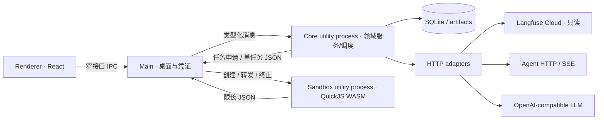
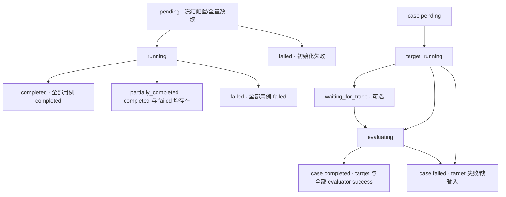

# evalit v0.0.1 技术设计

| 版本 | 日期 | 输入基线 | 状态 |
| --- | --- | --- | --- |
| techv_0.1 | 2026-09-20 | PRD docv_0.3；Git a58d008；designs 原型；用户确认 Langfuse SaaS | 技术设计基线，产品实现尚未开始 |
| techv_0.2 | 2026-09-20 | 零上下文独立评审；CHG-20260920-003 | 三轮评审达成一致；10 项问题闭环；产品及外部集成仍待实施验证 |

本文中的“必须”是实现与验收契约；标为“设计默认值”的内容由本设计明确选定，后续调整同样经过技术设计、测试、实现。外部服务的验证前提见[决策记录](decisions.md)。本文不代表已完成开发或已验证真实 Cloud 账号。

配套文档：[测试策略及用例](testing_strategy.md)、[严格 TDD 工作流](tdd_workflow.md)、[需求追踪矩阵](traceability.json)、[初始变更记录](../changes/CHG-20260920-001.md)、[独立评审与修订记录](../changes/CHG-20260920-003.md)。产品依据为 [PRD](../product_docs/evalit_v001_prd.md)，视觉依据为[原型](../../designs/evalit-prototype.html)和[设计交接](../../designs/DESIGN-HANDOFF.md)。

<a id="td-scope"></a>
## 1. 范围与规则优先级

覆盖 func_1—func_20：连接管理、测试集、评估对象、评估器、计划、执行、结果与导出、版本及编辑。应用是 macOS 单用户本地桌面工具，不建设服务端、多租户、账号体系或云同步，不向 Langfuse 写 Dataset、Trace、Experiment、Score。

规则优先级：用户明确补充 > PRD > 技术设计 > 视觉原型。用户已确认使用 Langfuse Cloud，替代 PRD 背景中的“私有化”部署假设。原型中的模拟数据、localStorage、模拟网络调用、简化编译器与 iframe 沙盒不作为生产实现。

开发交付必须遵循[严格 TDD 次序](tdd_workflow.md#td-tdd-order)。无对应设计和先行测试的实现不可合入。测试目标同时包含正向行为、失败行为、边界和副作用，不能以“能运行”替代验收。

<a id="td-architecture"></a>
## 2. 总体架构与技术栈

采用 Electron + React + TypeScript 的单仓库模块化架构。主要理由是原型可复用、跨 UI/编排/评估器契约使用同一语言、桌面行为能自动化测试。接受比 Tauri 更大的安装包，以减少首版 Rust/JS 双栈和跨语言测试成本。

| 层 | 选型 | 边界 |
| --- | --- | --- |
| 桌面壳 | Electron 稳定版、Electron Forge | 窗口、IPC、凭证、文件选择、进程生命周期 |
| UI | React、TypeScript strict、Vite、React Router | 表单、映射编辑器、结果视图；不直接访问文件或网络 |
| UI 数据访问 | TanStack Query + 类型化 IPC 客户端 | 列表缓存、mutation 失效、事件后重新查询 |
| 领域与应用层 | 纯 TypeScript、Zod 边界校验 | 版本、映射、状态机、运行编排；不依赖 React/Electron |
| 持久化 | SQLite + better-sqlite3、SQL 迁移 | 单写者、事务、不可变版本和运行快照 |
| 外部 HTTP | Node HTTP 客户端/undici，统一包装 | 明确超时、流读取、无隐式重试 |
| JSON Schema | Ajv；内部 JSON Schema 2020-12 | 不做隐式类型转换，不自动补默认值 |
| TS/JS 执行 | TypeScript 编译器 + QuickJS WASM | 独立进程，无宿主能力桥接 |
| 文件 | csv-parse；ExcelJS | 流式解析 CSV、生成真实 XLSX |
| 测试 | Vitest、Testing Library、fast-check、Playwright | 单元、组件、集成、契约、桌面 E2E、视觉 |
| 工具链 | Node 24 LTS 开发环境、pnpm workspace | 精确版本和完整性由实施时 lockfile 固定 |

以上为库的选型，不是“已安装清单”。实施 M0 时核验版本、许可证、Electron 内置 Node ABI、macOS 签名及原生模块打包，锁定精确版本；不得直接使用 latest 浮动依赖。开发机现有 miniconda 保留，本应用不要求用户安装 Python、conda、Docker 或 Node。



Main 保持轻量；Core 是 SQLite 唯一写者，负责异步网络与调度，避免同步 SQLite/大文件操作卡住 UI。文件导入、导出、TS 编译可用受控 worker；不让这些 worker 写数据库。Sandbox 每个任务使用新进程或一次性干净 runtime；MVP 默认新进程，达到并发上限后排队。

Main broker 是 Core、编译 worker 与 Sandbox utility process 的唯一创建/终止者；Core 通过固定任务协议申请执行，不调用 Main-only 的 utilityProcess API。Main 在 app ready 后使用固定本地入口启动，env 为最小白名单，不继承用户 Secret；记录 coreEpoch + taskId + child handle，消息带同一所有权标识。Core 退出后旧 epoch 的申请和结果一律拒绝，Renderer 不能直接提交 worker 路径或启动参数。

Main 负责硬截止：执行预算到期立即拒绝结果，并对仍归属该任务的活 child 发 SIGKILL；不能仅依赖 utilityProcess.kill() 的 SIGTERM。只使用当前注册句柄对应的活进程身份，禁止按缓存的裸 PID 延迟杀进程。名额与句柄在收到 exit 后释放；无法确认终止时停派并提示错误，不能继续启动无限个替代进程。Core 恢复前必须确认旧 Core 和所属 worker/Sandbox 全部 exit，随后新建 epoch，防止同时存在两个 SQLite 写者。[Electron utilityProcess](https://www.electronjs.org/docs/latest/api/utility-process)

Node utility process 本身不等于安全沙盒。真正执行不可信代码的是无宿主模块、无宿主对象引用的 QuickJS WASM 上下文；外层独立进程用于超时硬终止和故障隔离。Electron Renderer 的隔离设置见[安全设计](#td-security)。

目录目标如下；这是计划结构，本次不创建空实现：

```text
apps/desktop/src/{main,preload,renderer}/
packages/domain/src/{datasets,mapping,targets,evaluators,plans,runs,versions}/
packages/application/src/{commands,queries,ports}/
packages/adapters/src/{sqlite,langfuse,llm,http,files,secrets}/
packages/runner/src/{scheduler,recovery,sandbox,sse}/
packages/contracts/src/           # IPC DTO、JSON Schema、错误码
tests/{unit,integration,contract,component,e2e,visual,docs,fixtures}/
tools/{tdd,architecture}/
docs/{product_docs,technical_docs,changes}/
```

依赖方向：renderer → contracts；application → domain + ports；adapters → ports；runner → application/domain。domain 不引用 Electron、数据库、网络或 UI。架构测试禁止反向依赖，防止业务规则重复写在 UI 与后端。

<a id="td-data"></a>
## 3. 领域对象与数据结构

统一 ID 为随机 UUID，UTC 时间存 ISO 8601 毫秒；序号/计数用整数；JSON number 必须有限。数据库、对象版本、运行快照、适配器协议分别拥有独立 schemaVersion，不混用文档版本。

| 对象 | 标识/可变部分 | 版本内容/不可变部分 |
| --- | --- | --- |
| LangfuseConnection | id、baseUrl、remoteProjectId、name、secretRef、capabilities | 首版不提供历史版本；运行冻结有效连接参数 |
| LlmConnection | id、baseUrl、modelCodes、secretRef | 模型列表；被对象使用的 modelCode 固化于对象版本 |
| LocalDataset | id、name、currentRevision、archivedAt | 列名及次序、原始字符串行、字段映射、标准用例 |
| RemoteDataset | id、connectionId、remoteDatasetId、remoteName | 仅关联；无 evalit 对象版本，无长期行缓存 |
| AgentTarget | id、name、currentRevision、archivedAt | 服务类型、请求结构、Header、变量、响应 Schema、SSE 规则、Trace 配置 |
| PromptTarget | 同上 | LLM 引用、模型、system/user、变量集、temperature/top_p |
| CodeEvaluator | id、唯一名称、currentRevision、archivedAt | TS/JS、源码、编译器版本、输入变量、指标契约 |
| LlmEvaluator | 同上 | LLM 引用、模型、Prompt、参数、输入变量、指标契约 |
| Plan | id、name、currentRevision、archivedAt | datasetId、targetId、非空且无重复 evaluatorIds、映射 |
| Run | id、planId、状态、计数、错误 | 完整配置快照、完整数据快照、选择用例、产出及事件 |
| CaseExecution | runId + ordinal | 用例数据、target 结果、Trace 结果、逐评估器结果 |

标准用例内部命名统一为 `{input, expectedOutput?, metadata?}`；UI 保留“expected output”。缺失属性与显式 null 不混淆；导出时 JSON 原值保留。单个输入本身可以是 JSON 标量、数组或对象，如何映射由具体变量的契约决定。

变量通过不可变 `variableId` 寻址，显示名不作为数据库关联键。Agent body 变量和 Header 变量分命名空间，例如 `body.question` 与 `header.x-tenant-id`；一个输入值供两个位置使用时建立两条映射。Header 名统一小写作为标识，保留原始拼写显示。

边界合同中的通用类型如下；具体运行 DTO 不返回内部 secretRef 的可解密能力：

```ts
type JsonValue = null | boolean | number | string | JsonValue[] | { [key: string]: JsonValue };
type MetricDefinition =
  | { key: string; type: "numeric" | "boolean" | "text" }
  | { key: string; type: "categorical"; options: [string, ...string[]] };
type EntitySnapshot = {
  entityId: string; kind: string; revision: number | null;
  versionLabel: string | null; content: JsonValue; contentHash: string;
};
type RunConfigSnapshot = {
  schemaVersion: 1; engineVersion: string; capturedAt: string;
  plan: EntitySnapshot; dataset: EntitySnapshot; target: EntitySnapshot;
  evaluators: EntitySnapshot[];
  connections: { id: string; baseUrl: string; modelCode?: string; secretRef: string }[];
  policy: { schemaVersion: 1; targetConcurrency: number; llmEvaluatorConcurrency: number; limits: JsonValue };
  selectedSourceOrdinals: number[];
};
```

内容哈希使用确定性 JSON 表示（对象 Key 排序，数组次序不变）与 SHA-256；只对持久化业务内容计算，不包括哈希本身和临时 UI 字段。RemoteDataset 的 revision/versionLabel 为 null，远端时间点存在单独 dataset manifest。

指标类型为 `numeric | boolean | categorical | text`，同一评估器 Key 区分大小写且唯一；分类选项非空、去重并保留定义顺序。至少一个输入变量和一个输出指标。所有 JSON 序列化均禁止原型污染路径，数据对象采用 own-property 访问。

<a id="td-storage"></a>
## 4. SQLite、文件与持久化事务

数据库放在 Electron userData 目录，默认 macOS 为 `~/Library/Application Support/evalit/`；实际以 app.getPath('userData') 为准。代码不硬编码用户目录。目录权限 0700、数据库和产出文件 0600；测试通过独立临时 userData 隔离真实数据。

| 表 | 关键字段、约束、索引 |
| --- | --- |
| schema_migrations | version PK、checksum、applied_at；禁止更改已应用迁移 |
| connections | id PK、kind、base_url、remote_project_id、name、config_json、credential_id、capabilities_json；Langfuse base_url + project_id 唯一 |
| credentials | id PK、encrypted_blob、key_provider、created_at；不记录明文 |
| entities | id PK、kind、name、archived_at、current_revision、revision_counter、created_at、updated_at；评估器共享名称唯一约束，归档不释放名称 |
| entity_versions | entity_id + revision PK、label、schema_version、content_json、content_sha256、created_at |
| local_dataset_rows | dataset_id + revision + row_id PK、ordinal、raw_json、standard_json；ordinal 唯一 |
| remote_dataset_links | dataset_id PK、connection_id、remote_dataset_id、remote_name；来源身份唯一 |
| entity_references | from_entity_id、to_entity_id、relation；实体级引用，不随版本淘汰丢失 |
| runs | id PK、plan_id、requested_plan_revision、request_id UNIQUE、status、snapshot_state、selected_count、completed_count、failed_count、created_at、queued_at、started_at、finished_at、error_json |
| run_snapshots | run_id PK、schema_version、config_json、dataset_manifest_json、content_sha256；sealed 后禁止更新 |
| run_dataset_items | run_id + source_ordinal PK、source_item_id、input_json、expected_json、metadata_json、selected；包含完整拉取数据 |
| case_executions | run_id + ordinal PK、state、target_status、trace_status、output_ref、trace_ref、error_json；状态为阶段结果的事务内镜像 |
| evaluator_executions | run_id + ordinal + evaluator_id PK、dispatch_state、terminal_status、input_ref、result_json、error_json |
| stage_attempts | run_id、ordinal、stage、evaluator_key、attempt_no=1、stage_revision、core_epoch、dispatch_state、terminal_status、started_at、ended_at；每阶段独立提交令牌 |
| run_events | run_id + seq PK、kind、case_ordinal、summary_json、created_at |
| artifacts | id PK、run_id 或 draft_id、relative_path、sha256、byte_length、kind、sensitivity、created_at |

terminal_status 仅 `success / failed / not_evaluable` 或 NULL；等待/执行中由独立 dispatch_state 表示，避免把内部调度状态加入 PRD 终态枚举。target 同理。case 和 run 的枚举直接采用 PRD。

SQL 基础约束必须落到迁移文件，而非只留在 service：ID/TEXT、时间/TEXT、counter/INTEGER、JSON/TEXT + json_valid CHECK、加密内容/BLOB；计数 CHECK >=0，revision_counter >=1。RemoteDataset 没有 current_revision，其他版本化实体必须指向自己的 entity_versions。关键外键可用复合键保证版本不跨实体。

stage_attempts 使用非空 evaluator_key（target/Trace 为固定哨兵值），避免 SQLite UNIQUE 对 NULL 允许多条的语义；唯一键为 (run_id, ordinal, stage, evaluator_key)，attempt_no 的 CHECK 固定为 1。运行查询索引至少包含 runs(status,created_at,id)、case_executions(run_id,state,ordinal)、evaluator_executions(run_id,evaluator_id,terminal_status,ordinal)、entity_references(to_entity_id)。snapshot_state 为 queued/building/sealed/failed，仅作内部初始化状态，不增加 PRD 的 Run 状态枚举。

stage_attempts 是阶段终态的唯一权威；每个 target、配置的 Trace、每个 evaluator 各一行，不能共用 case 级 stageRevision。封存时建立 queued 行（attempt_no=1 是唯一派发配额，不表示已经发送），携带当前 core_epoch；输入无效的阶段可从 queued 直接终止。派发用独立 CAS 从 queued 改为 dispatched 并递增 stage_revision，成功后才允许发请求。

结果 CAS 的 WHERE 同时匹配完整阶段主键、core_epoch、stage_revision=:expected 和 terminal_status IS NULL；提交后递增 revision。两个并发 evaluator 各自持有自己的 token，均可成功；重复/晚到结果 rowCount=0，只清理无引用临时产出，不追加事件或重复计数。阶段终态、case/evaluator 镜像结果、聚合计数及事件同一事务提交；聚合读取已提交的全部阶段，不能依赖回调携带的旧计数。恢复事务只在旧进程退出后终止遗留阶段，不获得再次派发配额。

数据快照的 staging 行可以分批写入以控制内存，但 sealed 标志、数量/哈希与运行用例及阶段占位必须在一个最终事务提交，调度器只接受 sealed。

所有外键启用；删除有关联的实体用 RESTRICT。run 保留实体引用和全量配置副本；历史版本淘汰不能级联删除 run。外部连接删除仅在无当前/保留版本/活动运行引用时允许；被引用时返回影响列表，不产生悬空引用。历史 run 只依赖冻结信息和凭证引用的生命周期，不依赖实时实体内容。

SQLite 启用 WAL、foreign_keys、busy_timeout 和同步持久化策略；所有写命令由 Core 串行入队，长网络调用不占数据库事务。设置 `synchronous=FULL`，以阶段提交持久性优先；WAL checkpoint 和数据库备份使用 SQLite 支持的方式，不能只复制正在写入的主数据库文件。[SQLite WAL](https://www.sqlite.org/wal.html)

需要原子性的事务：

1. 新建/编辑/回滚：插入完整新版本及本地行 → 更新引用及 currentRevision → 淘汰超 10 个版本 → 提交。
2. 创建运行：生成 pending/queued 记录 → 调度器取队首并复核计划版本 → 冻结本地配置/凭证引用 → 拉远端全数据到本次 staging → 同一事务封存快照和选择用例 → 允许派发；多个箭头之间可为独立事务，不跨网络持有事务。
3. 阶段完成：确认产出文件已原子落盘 → CAS 写阶段终态 → 更新聚合计数与 case/run 状态 → 写事件 → 提交 → 通知 UI。
4. 归档/删除：同事务验证引用与状态，避免检查后被另一操作引用。
5. 迁移：备份 → 校验原版本/checksum → 事务迁移 → 完整性检查；失败保持旧库可恢复，不能删除用户数据重建。

大对象写入与最终路径同卷的 `artifacts/.tmp/{uuid}`：完整写入并核对长度/哈希 → 文件持久化屏障 → close → 原子 rename 到不可变内容寻址路径 → 源/目标目录同步（新建目录时包含必要父目录）→ DB commit 登记引用和阶段终态。文件和目录屏障任一步失败都不提交成功引用；目标已存在时先核验哈希且不得覆盖其他已引用内容。仅文件 flush 或仅 rename 不等于目录项已持久化。[SQLite 原子提交说明](https://www.sqlite.org/atomiccommit.html)

ArtifactStore 屏障是平台端口，M0 验证 macOS 文件/目录同步及需要的 full-sync 能力；不支持时 fail closed，不悄悄退化成 rename-only。磁盘/文件系统仍需遵守持久化承诺，本设计不保证硬件损坏免疫。启动及读取时核验引用文件的存在性、长度与哈希；异常标 ARTIFACT_CORRUPTED 和产出不可用，不展示/导出为完整成功，不重发业务请求，也不篡改原先记录的执行终态。崩溃可留下无引用孤儿；仅清理确定无引用的临时产出，未完成运行产出保留到恢复处理结束。MVP 不自动删除历史运行或备份。

<a id="td-dataset"></a>
## 5. 测试集导入、预览与编辑

本地 CSV 采用 UTF-8（允许 BOM）、RFC 4180 引号/换行规则；不猜测编码，不将单元格自动转数字、日期、布尔或 JSON。保留 `001`、前后空格、原始行顺序。拒绝空/重复表头、列数不一致、无数据行、非法 CSV；错误包含源行号和列号。纯空白末尾行忽略，夹在数据中的空行按空行数据校验，不能静默丢失业务行。

单列表头映射结果就是该字符串；多列映射为按原列名组成的 JSON 对象。未映射列在原始行中保留供编辑和以后新增映射。input 不能缺失、null、空白字符串；多列 input 不能所有被映射值都为空白。空对象、空数组来自远端时可保留，由具体变量和评估器判断；0 和 false 是有效 input。

预览每页默认 10 条，总计最多 50 条，仅是展示限制；解析、导入验证、运行快照必须处理全部数据。选择文件后生成内存/短期临时 Draft；取消时清理，保存时事务写完整行。Langfuse 预览数据仅驻留当前交互内存，不用来建立运行快照。

本地编辑保留 rowId；新增行追加 ordinal，删除后重排显示序号，至少一行。原列名与顺序不可改。字段映射采用稳定列 ID + 标准字段枚举，已有列映射不可删除或改目的地；原来单列映射的标准字段不可扩展为多列，已有多列组合可增加未映射列。保存前展示当前关联计划，在后端再次完整校验。

远端 dataset 的唯一键为连接地域/baseUrl + remoteProjectId + remoteDatasetId；被归档的关联仍占用唯一键，避免重复导入。名称只是显示/调用参数，不能作为唯一身份；重命名后通过 ID 重新定位当前名称，找不到时提示来源丢失，不能关联同名新数据集。

<a id="td-mapping"></a>
## 6. 字段路径与变量映射

内部使用 JSON Pointer（RFC 6901）定位唯一节点，UI 可显示 `input.customer.name`、`input.items[0]`；保存时规范化为 token 数组/Pointer。对象 Key 中的点、斜杠、波浪号和空格按原义处理；不支持通配符、递归、过滤器、表达式或模板代码。数组索引必须是非负整数；越界返回 Missing。

```ts
type MappingSource =
  | { kind: "dataset"; field: "input" | "expectedOutput" | "metadata"; pointer: string }
  | { kind: "target_output"; pointer: string }
  | { kind: "trace"; observationName: string | null };
type Binding = { variableId: string; source: MappingSource };
type Resolved = { found: false } | { found: true; value: JsonValue };
```

target 输入仅可来自 dataset；evaluator 输入可来自 dataset、target output、Trace。Prompt output 的标准根是字符串，pointer 为空可整体引用；不会自动把字符串 JSON 化供下钻。Trace 的 observationName 为 null/空白表示整条轨迹；非空名称大小写敏感匹配，其他规则见 Trace 一节。

保存计划时校验所有必填 body/Prompt 变量、所有 Header 变量和所有 evaluator 输入均有一条映射；禁止未知变量 ID、重复绑定和不适用来源。保存校验只能证明结构完整，无法保证每一行或未来远端数据都有该字段，运行时仍逐行解析。

body 变量必填性来自规范化 Schema 和已配置模板：根 body 始终必填；展开的 object 始终构造，属性在其父 object 的 required 中即必填，不因更上层属性可选而自动变可选。数组作为整体节点。只有非 required 属性可配置为可选变量；省略后仍需满足其余 Schema 约束，不自动剪掉父对象或自动补默认值。

可选 body 变量未绑定时省略该属性，而非写 null；它不产生输入缺失。已绑定但字段未命中、值为 null 或空白字符串时，无论该 body 属性是否可选，都按 PRD 为 not_evaluable，零网络调用。Header/Prompt/evaluator 没有未绑定例外。固定 null 属于显式模板常量，不走变量缺失判定，但必须被 Schema 允许。

合法 false/0/空数组/空对象不按布尔真值误判。变量类型不匹配但不缺失则是 `failed / INPUT_TYPE_MISMATCH`；构造后的完整 body 再按冻结 Schema 校验，结构违约为 failed / REQUEST_SCHEMA_MISMATCH，不发请求。Header 字段尤其仅接受字符串，不把数字、数组或对象隐式转换。测试集中的整行保留原值，变量构造不能修改原数据。

<a id="td-http"></a>
## 7. Agent 请求与配置导入

内部 AgentDefinition 包含 transport、method、urlTemplate、固定 path/query 值、headers、auth、bodySchema、bodyTemplate、bodySources、variables、responseSchema、traceConfig 和 parserRule。bodySources 为固定 JSON 值、固定 null、变量三选一；每个 schema 可配置节点必须且仅有一个来源。对象可继续展开；数组在首版作为整体节点，可整体固定或由变量提供，不提供循环表达式。

手动 Schema 使用 JSON Schema 2020-12 受限子集：type、properties、required、items、additionalProperties、enum、数值/字符串边界、nullable union。拒绝外部引用、循环引用、无法表达的复杂组合；明确错误路径，不静默省略条件。变量绑定的值须满足所选节点 Schema。固定“空值”含义为 null，Schema 不允许 null 时阻止保存。

HTTP 支持 POST、PUT、PATCH、DELETE 等允许 body 的接口；GET/HEAD 带 body 的接口因客户端支持不一致拒绝并说明原因。限定 JSON body；不支持 multipart、文件上传、GraphQL 自动转换。固定 path/query 在配置时完成，首版动态输入只通过 JSON body 和 Header。

鉴权支持 none、Bearer、Basic、API key（Header 或 query）；OAuth2/OIDC、签名算法和客户端证书不纳入自动配置，可由用户提供已获取的凭证。auth 独占其目标 Header/query Key，若同名 Header 设变量，用户必须先选 none/custom Header，不能让两个来源覆盖。Basic 用户名/密码与所有固定凭证只存 secretRef。URL 中禁止 userinfo。

Header 按不区分大小写判重；body/Header 变量 ID 分离。Content-Length、Host、Connection、Transfer-Encoding 由客户端管理；Content-Type 固定为 JSON，SSE 的 Accept 为 text/event-stream。启用 Trace 注入时 traceparent 为系统管理 Header；已有固定或变量 traceparent 会导致配置冲突，不能悄悄覆盖。普通字符串值验证 HTTP 合法性，包括拒绝 CR/LF/NUL。

curl 导入仅 tokenizer + 受限参数解析，不使用 shell、exec、eval。允许单个 URL、-X/--request、-H/--header、-d/--data/--data-raw 的内联 JSON、--url、-u/--user；对 --data-binary 仅接受内联文本。拒绝 @file、命令替换、反引号、变量展开、管道/重定向、--config、文件上传、多请求和未知会影响语义的参数。不能“忽略不支持参数后看似导入成功”。

OpenAPI 导入仅 3.0.x JSON/YAML；YAML 禁用自定义标签、限制 alias 与大小。选定 Operation 后解析 servers 优先级、path/query/header 参数、JSON requestBody、security 及响应参考。只有内部 $ref 可解析；循环/远程引用拒绝。required path/query 参数必须在配置中填写；server variables 按枚举/默认值补齐并展示最终 URL。多种 security 分支让用户选择受支持方案；不支持的 OAuth2 方案给出明确限制。Schema 的 nullable、allOf 等只有能无损归一化时才转换，否则阻止导入并定位原因。OpenAPI 响应只作参考，最终契约由实际试调用产生。[OpenAPI 3.0.3](https://spec.openapis.org/oas/v3.0.3.html)

配置试调用每次均由用户触发，无自动重试。ValidationReceipt 是以下短期回执的组合，不用一个包含派生产物的循环哈希；均由 Core 保存于 Draft、绑定 draftId/有效期/验证器版本，Renderer 只能提交 ID：

| 回执 | 绑定输入与产出 | 失效与重验 |
| --- | --- | --- |
| TransportReceipt | 服务类型、method/endpoint/path/query、固定/变量 Header 与 body 模板/Schema、auth 的 secretRef、示例输入、系统注入策略、原始完整响应/事件哈希及本次 traceparent；不包含派生响应 Schema、解析规则或响应说明 | 任一实际请求配置/输入/凭证变更必须新试调用，旧回执及下游失效 |
| ParseReceipt | TransportReceipt ID/原始产出哈希、解析规则哈希（阻塞式为内置 JSON parser）、重建结果哈希、推断或锁定 Schema、SSE 已确认规则引用；生成规则另绑定说明/模型/请求体与事件哈希 | 只改 SSE 说明/生成模型：复用完整样本，不重新调用 Agent，但必须重新单轮生成、执行、确认；派生 Schema 生成不使 TransportReceipt 失效 |
| TraceReceipt | 独立 Trace 试运行的 TransportReceipt + ParseReceipt、Trace 方式/字段/项目/凭证/能力版本、完整 Trace 结果 | 开启或修改 Trace 必须用户再触发一次 Agent 试运行并验证，不得拿最初缓存输出冒充；只改 Trace 查询配置不废弃原传输证据，但旧 TraceReceipt 不可保存 |

保存检查当前请求、解析及开启时的 Trace 回执链全部有效，保存本身零网络调用。无 Trace 的首次 SSE 创建只需一次 Agent 请求；多次修改说明可复用该次完整事件。Trace 开启后增加的独立试运行可同时生成当前请求/解析回执，故通常合计两次 Agent 请求，不因 Trace 或响应 Schema 派生再制造第三次调用。注入模式改变实际请求 Header，第二次必须带注入策略及实际 traceparent；规则复用但须在该次新事件上执行并符合此前锁定 Schema。只改展示名称不使回执失效。

规则确认记录保存用户确认过的规则哈希、样例与输出；Trace 独立试运行可引用该确认记录，在新事件上重执行同一规则、检查锁定 Schema，再建立新的 ParseReceipt，不重新生成 LLM 规则。规则本身变更仍需重新确认。Core 用不可变 validationReceiptId 标识当前 Transport/Parse/Trace 组合（未完成阶段可为空），每次验证推进返回新 ID，旧组合不可用于保存；不要求 UI 拼接各阶段旧 ID。具体分阶段返回值见 IPC。

响应必须是合法 JSON；非 2xx、断连、超时、非 JSON、响应超过限制均失败。实际响应 Schema 推断：对象记录观测到的 Key 为 required 且 additionalProperties=false；number/integer 统一 number；数组合并已观测元素类型，空数组 items 为未知任意 JSON；null 仅证明可为 null。推断只是此时锁定的契约，不推测未出现字段。编辑与正式运行都验证锁定 Schema，不满足时失败；新形状需新建评估对象。

<a id="td-sse"></a>
## 8. SSE 与解析规则

使用 HTTP fetch/流读取支持 POST、body、自定义 Header；不直接使用浏览器 EventSource，因为本项目需要自定义请求且禁止其自动重连。按 SSE 标准处理 UTF-8 跨 chunk、多行 data、event、id、注释、CRLF、空行分帧；保存 rawEvent 序列及顺序。尾部未以空行终止的不完整 event 不作为完整事件交付；保留传输诊断。[WHATWG SSE](https://html.spec.whatwg.org/multipage/server-sent-events.html)

HTTP 连接正常 EOF 才表示完成。`[DONE]`、event:done、retry 字段不触发断连/重连；RST、读错误、总时限到期均为失败，不把已有部分输出当成功结果。成功接收后交给解析器，重建结果再按锁定响应 Schema 验证。

“解析规则”的实现形式明确为纯 JS 函数 `parse(events, requestBody)`，返回单个 JSON 值；由配置的 LLM 一次生成，无聊天历史。输入为当前试调用请求体、完整事件、用户响应说明，系统只附加固定函数契约。LLM 产出的代码是不可信数据，在与代码评估器相同的隔离引擎运行，时间/内存/输出有上限；不在应用宿主执行。

生成后检查语法、入口签名、运行结果与输出限额，UI 展示完整规则和重建 JSON。用户确认后封存规则源码、哈希、生成模型和版本，并建立 ParseReceipt；每次评测直接执行已保存规则，不再生成、不发起额外 LLM 调用。修正仅修改响应说明、重新单轮生成和确认，不允许直接聊天或无验证编辑脚本。Agent 编辑按第 7 节回执依赖重新验证：请求变更需新调用，仅解析说明变更可复用有效完整样本；响应 Schema 仍锁定。新解析规则使依赖旧 ParseReceipt 的 TraceReceipt 失效，启用 Trace 时仍需重新独立试运行。

无 LLM 连接时阻止流式 Agent 创建。事件或请求体超过规则生成的上下文/输入上限时清晰失败，不能截断后冒充“完整事件”。这一路径会把样例请求和响应发给用户选择的 LLM，确认界面展示目的服务及数据内容；Header 鉴权不会附加到生成 Prompt。

<a id="td-llm"></a>
## 9. LLM 连接、Prompt 与输出契约

实现最小 OpenAI-compatible Chat Completions 适配器：baseUrl 表示 API 根（例如带 /v1），只追加 /chat/completions；不自动再补一层 /v1。不按供应商分支，不依赖 SDK 的自动重试。发送 model、system/user messages、temperature、top_p，首版非流式；不强制 response_format、工具调用或推理专属参数。

连接校验对用户列出的每个 modelCode 发一条固定短请求，显示这是实际模型调用；不只依赖 /models，因为兼容服务未必支持。全部配置模型验证成功后保存。重复 modelCode 去重；不支持 temperature/top_p 的模型报告实际错误，不偷偷去掉参数。验证和业务调用均 retry=0。

Prompt 变量仅 `{{name}}`，name 为 [A-Za-z_][A-Za-z0-9_.-]*；system/user 变量集合去重，至少一个。模板引擎仅字面量替换，不支持条件、循环、表达式或对象方法，替换值不递归展开。字符串原样注入，其他合法 JSON 值经明确 JSON.stringify 注入，0/false 保留；缺失按映射规则处理。代码评估器直接收到类型化 JSON，不走 Prompt 文本化。

PromptTarget 固定输出为 choices[0].message.content 的字符串，未提供内容或 tool-only 响应视为失败。LLM evaluator 只接受一个 JSON 对象，可有一个无标注或 json 标注的 Markdown 围栏，前后仅可有空白；解释文字、多围栏、数组根、非有限数值、缺指标、指标类型不符均使整个结果 failed。额外 Key 保留，不参与指标统计。

text/categorical 不接受空白；numeric 0、boolean false 有效；分类精确匹配且区分大小写。错误返回 code、字段、expectedType、actualType，不能在错误字符串中拼接无法解析的 LLM 原文。失败原文仅作为受限加密诊断产出保存，不通过 UI、IPC、日志或 XLSX 暴露；用户可见错误仍足以定位格式/契约问题。成功结果可正常展示。

<a id="td-sandbox"></a>
## 10. TS/JS 代码评估器与隔离执行

入口统一为 `function evaluate(inputs) { return { ... }; }`，inputs 的 Key 是用户声明变量名。TS 允许类型标注、interface/type 等；由真实 TypeScript 编译器检查并转 JS，禁止以正则去类型。首版只允许同步返回 JSON 对象；Promise、顶层 await、import/export、require、动态 import 均拒绝，界面提供符合契约的 TS/JS 模板。

编译阶段同样受隔离约束：受控一次性编译进程使用纯内存 CompilerHost，仅固定虚拟源码与随应用打包、哈希固定的 ECMAScript lib 白名单；noLib: true 后显式提供完整白名单依赖闭包，types: []、typeRoots: []、noResolve: true。不得回退 ts.sys/default CompilerHost、读取用户 tsconfig、自动寻找 @types、解析磁盘包或下载依赖；getSourceFile/readFile/fileExists/目录及 module/type resolve 全部只查虚拟文件表，writeFile 只收集内存输出。

用户源码的 triple-slash reference path/types/lib、import type、JSDoc import 与其他外部依赖指令先解析并明确拒绝；编译器诊断只出现虚拟文件名。固定内置 lib 的合法引用仅在预载闭包内满足。防护必须由 canary 证明编译期也无宿主文件读取或网络访问，不能只测 QuickJS 执行期。[TypeScript 引用指令](https://www.typescriptlang.org/docs/handbook/triple-slash-directives.html)、[Compiler API](https://github.com/microsoft/TypeScript/wiki/Using-the-Compiler-API)

只暴露 ECMAScript 内建的 JSON、Math、String、Array、Object、RegExp 等；不提供 Node、浏览器、计时器、网络、文件、环境变量、子进程、宿主回调或第三方包。必要补充库首版为空；后续增加必须列白名单、测试并版本化。静态检查用于报错体验，真正的能力隔离依赖无宿主桥接的 runtime。

执行流程：Main broker 创建受控编译进程完成编译/语法验证 → Core 生成任务 JSON → Main 创建新 Sandbox utility process 加载本地可信 WASM → 创建新 runtime → 设置内存/栈/中断 → 在 sandbox 内解析输入并调用入口 → 在 sandbox 内 JSON.stringify → 按 UTF-8 字节限长 → Main 转发给 Core 解析并进行指标校验 → 清理句柄和进程。

设计默认值：执行 5,000ms、输出 100,000 字节（不等同 100KiB）、QuickJS heap 64MiB、栈 1MiB、单任务输入 10MiB、代码 256KiB。5 秒由 Main 在发送执行指令时启动，包含引擎内解析、执行与序列化、不包含排队；截止行为见 Main broker，不只依赖引擎回调。进程启动/可信资产加载有独立 5 秒截止，未就绪不能占位不退出。TS 编译发送指令后也有独立 5 秒硬上限。

JSON 序列化失败、循环引用、BigInt、function、undefined、NaN/Infinity、非对象根均失败；不能让 JSON.stringify 将 NaN 偷转 null 或丢 Key 后视为成功。getter/toJSON/恶意 RegExp 的执行受相同截止和限额约束。超时/内存/输出超限是单评估器 failed，其他任务继续。

QuickJS 包提供 memory/stack/interrupt 控制，但项目说明未经过安全审计；因此增加进程边界、硬超时、最小输入和恶意测试，不能声称绝对不可逃逸。不得以 Node vm、iframe 或浏览器 Worker 替代此安全边界。[QuickJS WASM](https://github.com/justjake/quickjs-emscripten)、[运行时控制](https://github.com/justjake/quickjs-emscripten/blob/main/doc/quickjs-emscripten-core/classes/QuickJSAsyncRuntime.md)

<a id="td-langfuse"></a>
## 11. Langfuse Cloud 只读适配

通过配置的区域 baseUrl + Project Public/Secret Key Basic Auth 接入；不假定用户地区。GET /api/public/projects 返回可访问项目并读取 id/name，按 baseUrl + projectId 判重；不根据 Public Key 字符串判断同一项目。凭证详情脱敏。

使用自己封装的只读 REST adapter；不初始化会自动埋点/上传的 Langfuse SDK。请求层仅允许白名单 GET 路由；测试服务器检查零 POST/PUT/PATCH/DELETE。不能把 dataset run、experiment item 或 Trace 数据充当 Dataset 数据来源。

| 能力 | Cloud 接口与行为 |
| --- | --- |
| 项目身份 | GET /api/public/projects |
| Dataset 列表/详情 | GET /api/public/v2/datasets；GET /api/public/v2/datasets/{name} |
| Dataset 行 | GET /api/public/dataset-items，datasetName + page/limit + 固定 version 时间点 |
| Trace/Observation | GET /api/public/v2/observations，traceId/时间范围/fields，完整 cursor 分页 |
| metadata 查 Trace | 匹配 Trace metadata，严格核对类型和值，按 traceId 去重；Cloud 读取适配见 ADR-005 |

Cloud 的当前推荐读取方式为 Observations API v2，旧 Trace 读取接口有迁移要求。完整页面和 API schema 以[Cloud Public API](https://langfuse.com/docs/api-and-data-platform/features/public-api)、[迁移说明](https://langfuse.com/faq/all/deprecated-api-migration)、[官方 OpenAPI](https://cloud.langfuse.com/generated/api/openapi.yml)为依据；实施时固定脱敏契约 fixture 和 schema 哈希，不跟随 SDK 默认行为漂移。

Dataset 在每次 Run 初始化实时全量分页拉取，固定同一个远端 version 时间点以避免分页期间编辑造成混合快照；这是 Cloud 读取一致性参数，不给 RemoteDataset 引入 evalit 版本管理。记录 snapshotRequestedAt、源 dataset ID、sourceVersion、页数、item IDs 和哈希。使用 API 返回的源序列作为 sourceOrdinal，绝不先截 top N 或按输入值重排。若上游不承诺固定版本下稳定次序，真实契约测试必须验证；不能伪称跨运行同一个 top N 永远相同。

保留拉取的全部 item 及远端状态；ACTIVE item 按源顺序组成可执行集合，ARCHIVED item 不执行但保留于本次来源快照。totalSourceCount、eligibleCount、selectedCount 分开。选择 top N 前先全量成功，selectedCount=min(N, eligibleCount)；N 必须正整数，超出数量时显示实际执行数。空可执行集为初始化 failed。分页缺页、重复 ID、版本不支持/不一致、超限均失败，不拿残缺数据运行，不自动回退无版本读取。

Cloud Observation 查询必须取所有需要字段：core,basic,time,io,metadata,model,usage,prompt,metrics,trace_context。metadata 默认可能截断，先收集 Key，再在同轮查询中用 expandMetadata 获取完整值；重复展开仅属于一次读取阶段的补全，不是 Agent/评估器重试。超过 URL/分页/时间/数据限额无法完整还原则 Trace 拉取失败，不能把截断数据当完整轨迹。

Trace metadata 与节点私有 metadata 必须在语义上区分。关联适配器提供 findTraceIdsByTraceMetadata(key, value, timeRange)，匹配的始终是 Trace 级字段。可通过仍可用的 Trace 读取接口读取真实 trace.metadata；若采用新版 Observation 接口，必须用契约测试验证返回字段确实代表传播的 Trace 级 metadata，不能仅因属性同名就替代。无法证明等价时返回 TRACE_METADATA_UNSUPPORTED，不自动改成任意节点或根节点私有 metadata 查询，也不要求用户迁移关联字段的业务含义。旧 Trace 接口只可作为明确标记的兼容路径，不能当作永久依赖。

使用结构化 filter 时，时间上下界与 metadata 条件必须写入同一 filter 数组，不能以为独立时间参数仍生效；不能附加 isRootObservation=true 来改变关联范围。字符串/数字按相应类型比较；不把 true、1、"1" 视为相同。节点详情的 metadata 展开与 Trace metadata 关联是两件事；无法取完整值或区分字段来源时报告能力限制，不伪造完整/唯一结果。

IO 字符串若是合法 JSON 可解析成值，否则保留字符串，同时保留原始字段用于审计。TraceEnvelope 为本项目稳定协议：

```ts
type TraceEnvelope = {
  schemaVersion: 1;
  traceId: string;
  projectId: string;
  traceMetadata?: { value: { [key: string]: JsonValue }; provenance: "trace-api" | "verified-trace-context" };
  source: { api: "observations-v2"; fetchedAt: string; fields: string[] };
  observations: ObservationNode[]; // 同一 trace 全部节点，每个 id 唯一
  rootObservationIds: string[];
  rawArtifactRef: string;
  acquisition: { stable: boolean; completedAtDeadline: boolean };
};
```

ObservationNode 包含 id、parentObservationId、isRootObservation、name、type、时间、input/output、metadata 及其余源字段。依据 parentObservationId 建树，不用名称猜父节点；父节点在其他服务/项目时保留 orphan 诊断及可用子树；检测自环、环、同 ID 内容冲突，发现损坏则不交付“完整”轨迹。逻辑根与物理无父节点不必相同。

source 和 acquisition 是获取说明，不能混入“连续两次完全一致”的内容哈希；内容哈希包含所有完整的源字段，对象键排序、Observation 列表按稳定 ID 排序，保留业务数组顺序。这样仅 API 返回行序变化不会导致误判，任一业务字段/节点变化仍会打断稳定计数。

Langfuse 只保存已绑定来源信息；预览不长期缓存。运行快照和运行所需 Trace 属于 PRD 明确要求的持久化例外，不能将“无长期缓存”误解为不保存运行证据。

<a id="td-trace"></a>
## 12. Trace 关联、轮询与 Observation 选择

三种关联模式：

1. 响应字段：从成功输出的单节点路径读取非空字符串 traceId，不能假设外部 ID 一定 32 位十六进制。
2. traceparent 注入：每个实际调用生成非零 16 字节 traceId、8 字节 parentId，构造 `00-{traceId}-{parentId}-01`，Header 名不区分大小写。运行日志记录 traceId，不注入 evalit 内部遥测。Agent 必须采用同一 Trace Context，否则强制试运行不通过。[W3C Trace Context](https://www.w3.org/TR/trace-context/)
3. metadata 关联：字段 A 解析为非空标量；Trace.metadata 的 Key B 作为单个字面 Key（含点不下钻）。最近一天按 Agent 响应完成时间 t0 固定查询范围 [t0-24h, t0]，同一轮取全分页，对 Trace.metadata.B 与 A 的值作类型敏感精确比较、按 traceId 去重；查到唯一 ID 后再获取整条 Trace。此规则不按 Observation 名称或根节点筛选，节点私有 metadata 同名命中不算 Trace 关联成功。Cloud 物理读取方式由适配器解决，不能改写产品契约。

响应字段/注入模式优先仅按 traceId 查全量相关节点，避免随意加 24h 限制裁掉长轨迹；若 Cloud 契约要求时间窗口，适配器必须以真实试运行确定可覆盖范围并记录在配置，不得直接移植 metadata 的业务窗口。

轮询时钟从响应完成 t0 起，第一次立即读取，后续在 10、20、30、40、50 秒启动；绝不并发重叠，同轮未结束则跳过到下个槽位，60 秒为硬截止，包含网络、分页与补全。截止时以最近一次成功完成的完整读取为准；没有完整读取则失败。由此最多 6 次启动，不在第 60 秒另起请求使等待超限。

0 个 Trace 清空连续稳定比较并继续；完整读取出唯一 Trace 与上次成功完整读取完全一致且之间没有空结果/错误则成功；不同则更新候选。任一轮发现多个不同 traceId 即失败且不传下游。到截止仍只有一个完整候选，取最后候选并标明 stable=false；最后一轮空结果或错误时仍可保留前一完整候选，但不得把它标为“连续一致”。401/403 和不支持能力立即失败；429/5xx 记录本轮错误，最多等下一个预定轮询，不额外发起重试。

如果配置了 Trace，Agent 输出成功后进入 waiting_for_trace，完成获取后统一释放 evaluator 任务。Trace 失败不把 target 从 success 改 failed；仅依赖 Trace 的评估器 not_evaluable，其余按自身输入继续执行。未配置 Trace 跳过该阶段。

按名称选择时：区分大小写，收集所有同名节点及全部后代，按 node.id 去重；若已命中祖先，后代命中节点不再成为第二个重复根。输出为树数组，每个节点仅出现一次；未匹配为 []（有效输入）；不填名称传整个 TraceEnvelope。循环检测先于子树遍历。

Observation 选择只在 Trace 已定位并获取后发生，用来确定评估器收到哪些节点；不能把该选择条件提前拿来决定 metadata 关联的是哪条 Trace。Trace metadata 的来源与可读取性作为适配能力记录，不用空对象冒充未取得的 Trace metadata。

Cloud 上报延迟可能超过 60s。系统不承诺“能在 Cloud UI 看见就能立即读取”，强制试运行必须覆盖所用 Agent 的真实上报方式；超时按 PRD 处理，不私自扩大等待时间。[Cloud 兼容与数据时效](https://langfuse.com/docs/compatibility)

<a id="td-plan"></a>
## 13. 计划与生命周期

计划始终是一个 dataset + 一个 target + 一个或多个不重复 evaluator。保存引用实体 ID 和映射，不固定其旧版本；每次 Run 在同一个本地读取事务中解析各对象当前生效版本，再冻结全部内容。远端 dataset 行在该次初始化时实时获取；运行开始后不再读取实时配置。

新建时禁止选择已归档实体；已存在计划仍可使用归档实体，这是对 PRD“禁止用于新建计划”的设计解释。归档计划不可执行，不删除历史运行。被任一计划（包括归档计划）或运行引用的核心对象不能硬删除。运行存在的计划也只能归档。删除前后均后端校验并要求 UI 二次确认 token，不能只靠前端按钮隐藏。

影响预览列出所有引用该对象的计划和其状态；保存时携带 expectedRevision 做乐观锁，若其他窗口/任务已修改则返回 CONFLICT，让用户重新检查，不能覆盖。无语义变化的保存不新增版本，除回滚明确复制为新版本外。

<a id="td-version"></a>
## 14. 版本、编辑与回滚

revisionCounter 为单调递增正整数，显示 label 为 floor(counter/10).(counter%10)，首个 counter=1 对应 0.1；0.9→1.0。不使用浮点数加 0.1。每个实体最多 10 个版本含当前，counter 不因淘汰或回滚回退。

内容全部不可变；本地 dataset 的原始行与标准行随版本保存。回滚是复制目标完整内容为最新 counter+1，不移动指针、不复用旧编号。所有实体的基础结构/外部输入输出合同按创建后锁定规则校验；以下是各类额外约束：

| 类型 | 编辑不变量 | 回滚校验 |
| --- | --- | --- |
| 本地 dataset | 列名不变、至少一行、已有列→标准字段映射不可减、单列不可变组合 | 目标包含当前全部映射；禁止回滚丢映射 |
| Agent | 服务类型、请求/响应 Schema、body 变量定义、Header 变量定义锁定 | Trace 已开不可变关闭；锁定字段始终一致 |
| Prompt | 同一变量集合，保留 LLM/model；改 Prompt 和 temperature/top_p | 与创建后的输入接口一致 |
| Code evaluator | 语言、输入变量、指标契约锁定；重验语法 | 按 PRD 无额外业务回滚限制 |
| LLM evaluator | 变量与指标契约锁定；改 Prompt/参数 | 按 PRD 无额外业务回滚限制 |
| Plan | dataset/target/evaluator 集合锁定；仅改映射 | 按 PRD 无额外业务回滚限制 |
| RemoteDataset | 不可编辑本地数据；无本地版本 | 不提供版本/回滚 |

Agent 固定 Header 可编辑/增删，已有变量 Header 的名称、变量 ID、类型均不可调整；不能把原固定 Header 转变量，也不能新增变量 Header。固定/null body 来源可互换，不能变变量。Trace 可从关闭开启，不能关闭；Trace 字段/Project/模式改动要完整试运行。

历史版本的清理不会删除 run_snapshot 内容、凭证加密版本或产出；Credential 的垃圾回收必须检查保留对象版本、Draft、活动与历史运行引用。回滚使用旧 secretRef 可能对应已撤销的外部凭证，历史可查看但新运行可能失败，不能以快照存在承诺外部可重放。


<a id="td-run"></a>
## 15. 运行编排、并发与状态机

运行持久化分为初始化、执行、封存。Run 配置含 selectedLimit、targetConcurrency、llmEvaluatorConcurrency、engineVersion 和所有资源限额。前端只提交意图，调度与计数由 Core 执行，关闭/重新打开页面不停止运行。



执行步骤：

1. UI 生成 requestId 调用 run.create；数据库唯一约束确保双击/IPC 超时重发只返回同一 Run，不产生重复调用。
2. 调度器取队首，再次校验计划仍为 requestedPlanRevision 且未归档，否则该次初始化 failed / PLAN_CHANGED。随后同一本地事务冻结 Plan、当前版本对象、连接配置、secretRef、运行参数，并进入 snapshot_state=building。本地数据一起冻结，远端数据按前述规则 staging，全量成功才 sealed。
3. 封存配置快照、全数据清单、selected 用例及每个“用例 × evaluator”结果占位，持久化后开始执行。初始化失败不调用任何目标服务。
4. 准备 target 输入；缺失直接 not_evaluable，类型不符 failed。target 因输入、HTTP 或解析等任何原因 failed/not_evaluable 时，在写入 target 终态的同一事务将全部未执行 Trace 和 evaluator 阶段置 not_evaluable / TARGET_UNAVAILABLE，并同步结果镜像；不留下 queued 依赖，也不调用外部服务。
5. 持久化 stage_attempt dispatch intent 后，获取 target semaphore 调用一次 Agent/Prompt。写 output/终态后释放 target semaphore，Trace 等待不占目标请求名额。
6. Agent 配置 Trace 时读取 Trace，单独记录 trace outcome；Trace 失败不抹掉成功 target output。
7. 为每个 evaluator 解析自己的输入并独立派发；缺输入/缺依赖 Trace 的仅该 evaluator not_evaluable。LLM 和 code 用不同 limiter，一个失败不能取消兄弟。
8. 每个阶段提交事务后更新事件与 UI。target、配置的 Trace、全部 evaluator 占位都收敛到终态后再汇总 case；全部 case 终态后再汇总 run 并写 finishedAt。Trace 终态只决定依赖输入可用性，不改变下面的 PRD case 聚合公式。

target 并发与 LLM evaluator 并发分别独立，设计默认均为 3，可输入 1—32；code concurrency 默认 min(4, CPU 数)，Trace HTTP 并发默认 4。MVP 同时仅一个 Run 活跃，其他 Run pending FIFO 排队，避免多个 Run 的“并发 3”实际无限累加。试调用与正式运行共用全局网络上限；试调用排队独立显示。

输入解析和已就绪任务按有限队列生产，不为全数据一次 Promise.all。各阶段任务带 runId、ordinal、stage、evaluatorKey、coreEpoch、独立 stageRevision，提交遵循 stage_attempts CAS；终态不可回到运行中。

终态汇总是纯函数：

- case completed ⇔ target=success 且所有 evaluator=success；其余终态组合为 failed。
- run completed ⇔ selectedCount>0 且 completedCount=selectedCount。
- run partially_completed ⇔ completedCount>0 且 failedCount>0 且全部终止。
- run failed ⇔ 初始化失败，或 selectedCount>0 且全部 failed。
- 指标 false、numeric 0、categorical 的任何合法分类都不会自动导致 case failed。

PRD 无取消/暂停/恢复执行，首版不增加这些业务状态或重跑接口。macOS 关闭窗口保持应用运行；显式 Quit 时若有运行，提示退出会中断，可取消退出或确认退出。操作系统强杀/断电由恢复规则处理，不借机自动重发请求。

<a id="td-recovery"></a>
## 16. 崩溃恢复与“绝不自动重试”

网络库、LLM adapter、调度器、Sandbox 均关闭自动 retry，SSE 禁止重连。Trace 定时轮询是 PRD 定义的读取流程，不是重试目标调用。UI 可以新建一次完整 Run，但没有重试失败用例/评估器或续跑按钮。

本地持久化与外部 HTTP 不能跨系统原子提交，无法承诺外部服务 exactly-once。实现承诺：一个 stage 本地最多派发一次；进程异常后不猜测远端是否已执行，不重发。数据库在派发前先写 intent，故可能出现“记录已派发但实际上尚未发送”，恢复仍保守终止并保留原因。

启动或 Core 崩溃后的恢复事务：

| 崩溃位置 | 恢复行为 |
| --- | --- |
| 初始化未 sealed | run failed / SNAPSHOT_INTERRUPTED；不使用半份数据启动 |
| target 未开始或已 dispatch、未持久化终态 | target failed / EXECUTION_INTERRUPTED；未终态 Trace/evaluator 全部 not_evaluable / TARGET_UNAVAILABLE |
| target 已 failed/not_evaluable、遗留 Trace/evaluator 仍 queued | 保留 target；同事务将未终态依赖补为 not_evaluable / TARGET_UNAVAILABLE，无外部调用 |
| target 已 success、Trace queued/dispatched | 保留 output；Trace failed / EXECUTION_INTERRUPTED；依赖 Trace 的 evaluator not_evaluable；其余按下面未开始/已派发规则终止 |
| target success、evaluator 已 dispatch 无终态 | 该 evaluator failed / EXECUTION_INTERRUPTED；不补调用 |
| target success、evaluator 尚未开始 | 输入依赖缺失则 not_evaluable；否则 failed / EXECUTION_INTERRUPTED |
| evaluator 已终态 | 原样保留结果，禁止覆盖 |
| 全部阶段已终态但 Run 尚未汇总 | 从已持久化结果重算 case/run 与计数，无外部调用 |

恢复覆盖每个已封存的 stage_attempts 占位，不留下 queued/dispatched 的悬空阶段；已经提交的终态原样保留。所有未结束用例都进入终态后，再依定义得到 completed/partially_completed/failed。即使所有外部请求已成功而最终汇总前崩溃，只要结果已经提交，恢复可以得到 completed。

Main broker 追踪 Core、编译进程与 Sandbox，Core 异常时停止新派发、关闭旧 epoch 通道、终止其所属进程，确认全部 exit 后才启动新 Core 恢复数据库；重启只恢复服务能力，不恢复旧业务执行。单实例应用锁避免两个 Main 同时拥有调度权。设备睡眠不主动阻止系统休眠；唤醒后核对 wall-clock 截止并终止过期请求，不能因计时器暂停把 60 秒变成无限等待。

磁盘满/事务失败为系统持久化故障：立即暂停所有新派发、尽力 abort 在途请求，提示存储错误；不展示未持久化的成功。重启后按已落库证据恢复，外部副作用可能发生这一事实保留在错误提示。

<a id="td-ipc"></a>
## 17. 桌面 IPC 与应用服务契约

唯一桥接入口为 `window.evalit` 的固定函数集合；不暴露 ipcRenderer、通用 channel、任意文件路径读写、任意 SQL 或 fetch。请求/响应均 Zod 校验，主进程验证 senderFrame 来自本应用受信 origin。Core 消息另外校验协议版本和 correlationId。

```ts
type AppResult<T> =
  | { ok: true; data: T; revision?: number }
  | { ok: false; error: {
      code: string; message: string; field?: string;
      expectedType?: string; actualType?: string;
      correlationId: string;
    }};
type Page<T> = { items: T[]; total: number; nextCursor: string | null };
type RunEvent = { runId: string; seq: number; kind: string; occurredAt: string };
```

| 命令/查询族 | 代表接口与约束 |
| --- | --- |
| connections | list、validateLangfuse、createLangfuse、validateLlm、createLlm、delete；返回脱敏 DTO |
| datasets | list、get、previewRemote、importRemote、beginCsvImport、previewCsv、saveLocal、editLocal |
| targets | list、get、beginAgentDraft、parseCurl、parseOpenApi、testCall、generateParser、confirmParser、testTrace、saveAgent、savePrompt |
| evaluators | list、get、validateCode、testCode、testLlm、save；试运行也走正式契约和沙盒 |
| plans | list、get、validateBindings、create、editBindings |
| lifecycle | impact、archive、requestDeleteConfirmation、delete；expectedRevision + confirmationToken |
| versions | list、get、validateRollback、rollback；生成新版本 |
| runs | create、list、get、listCases、getCase、getMetrics、subscribe、unsubscribe |
| exports | chooseDestination、exportRun；主进程持有路径许可，renderer 仅得到 jobId |
| system | capabilities、health、migrationState；不返回机器环境或凭证 |

CSV 文件选择返回由 Main 签发的短期 fileToken，而非允许 renderer 传任意系统路径；文件读取限制为已选文件。导出同理，覆盖已有文件必须由系统保存对话框确认，应用不能自行覆盖其他文件。

主要写命令的 payload/返回值固定如下；各类 DTO 的 JSON Schema 归 packages/contracts 管理，前后端共享但后端仍独立执行校验：

| 命令 | 输入 | 成功返回 |
| --- | --- | --- |
| datasets.beginCsvImport | fileToken、displayName | draftId、headers、rowCount、最多 50 条 preview、errors |
| datasets.saveLocal | draftId、columnBindings；编辑另有 entityId/expectedRevision | entityId、revision、versionLabel |
| datasets.importRemote | connectionId、remoteDatasetIds[] | 各 datasetId 或逐项错误；每个关联独立事务，结果逐项显示 |
| targets.testCall | draftId、expectedDraftRevision、sampleInputs | blocking/streaming 辨别结果，均含 validationReceiptId 和 transportReceiptId；仅 blocking 含 parseReceiptId/outputArtifactId/inferredSchema；streaming 返回 eventsArtifactId，不返回未生成的 Schema |
| targets.generateParser | draftId、expectedDraftRevision、transportReceiptId、description、llmSelection | ruleDraftId、规则文本、重建结果及 proposedSchema；只调用生成 LLM，不产生已确认 ParseReceipt |
| targets.confirmParser | draftId、expectedDraftRevision、ruleDraftId | parseReceiptId、validationReceiptId、inferredSchema（创建）或 schemaValidated（编辑）；确认已显示的完整规则/输出，零 Agent 调用 |
| targets.testTrace | draftId、expectedDraftRevision、validationReceiptId、traceConfig、sampleInputs | 最新 validationReceiptId（后端含本次新 Transport/Parse/Trace 整链）、traceReceiptId、脱敏输出/Trace 预览；内部强制独立试调用 |
| targets.saveAgent | draftId、expectedDraftRevision、expectedRevision?、validationReceiptId | entityId、revision、versionLabel；检查最新完整组合，零网络调用 |
| evaluators.save | definition、expectedRevision? | entityId、revision、versionLabel；代码语法/指标/变量再验 |
| plans.create/editBindings | name（仅创建）、memberIds（仅创建）、bindings、expectedRevision? | entityId、revision、versionLabel |
| versions.rollback | entityId、targetRevision、expectedCurrentRevision | newRevision、newVersionLabel、copiedFromRevision |
| runs.create | requestId、planId、expectedPlanRevision、topN?、targetConcurrency、llmEvaluatorConcurrency | runId、status=pending；重复 requestId 返回同一 runId |
| exports.exportRun | runId、destinationToken | jobId；完成事件返回已选文件显示位置 |

批量关联远端 Dataset 的部分成功不回滚已经成功的其他关联，返回逐项结果并只允许用户再次选择失败项；这不是评估运行重试。run.create 收到过期 expectedPlanRevision 返回 CONFLICT，用户重新查看计划后才能开始。任务在 FIFO 中真正初始化时，解析各成员当前版本并冻结；队列等待期间不预拉远端数据。

编辑命令包含 entityId、expectedRevision、draftId 或完整已校验内容。Draft 状态与 ValidationReceipt 在 Core 管理；未通过相应校验的 save 直接拒绝，不能依靠前端按钮控制。Draft 默认 30 分钟内存有效，退出后丢弃，试调用大型产出临时文件随之清理；本次设计不新增“草稿自动恢复”产品能力。

Agent 验证相关命令均携带 expectedDraftRevision；Core 计算配置/输入哈希，不信任 Renderer 自报 configHash。返回当前 draftRevision，异步结果只允许应用到仍匹配的 Draft；过期结果不得更新当前组合回执。testTrace 校验当前已确认规则和 Schema，再生成第二次试调用的新链；saveAgent 只读取该 Draft 最新组合，不接受混搭回执或缺 Parse/开启时缺 Trace 的组合。

events 仅提供通知，数据库查询才是真实状态。seq 严格单调递增；订阅从 lastSeenSeq 补齐，发现缺口重新查询 Run。UI 每 100—250ms 合并刷新，最多每秒 4 次批量通知，大结果懒加载；不能通过每条 SSE chunk 的 IPC 更新拖垮 UI。事件不包含完整测试数据、Header 或 LLM 原文。

分页列表默认 20，运行用例默认 50，允许页大小 10—100；稳定排序 createdAt + id，运行用例固定 ordinal。RemoteDataset 预览仍单独限制总计 50。搜索与列表加载不触发模型/Agent 调用。

<a id="td-errors"></a>
## 18. 错误分类与可观察性

统一 ErrorCode 表；用户提示为中文，日志 code 为稳定英文。错误码不能替代 target/evaluator/case/run 的状态，状态聚合仅按正式枚举。

| 错误类别 | 典型 code | 结果 |
| --- | --- | --- |
| 配置/保存不合法 | VALIDATION_ERROR、UNSUPPORTED_SCHEMA、VARIABLES_LOCKED、CONFLICT | 拒绝保存，不生成新版本 |
| 输入缺失 | INPUT_MISSING、PATH_NOT_FOUND | 当前 target/evaluator not_evaluable |
| 输入类型/HTTP 构建 | INPUT_TYPE_MISMATCH、INVALID_HEADER、REQUEST_SCHEMA_MISMATCH | 当前 target failed |
| 目标传输 | HTTP_STATUS、REQUEST_TIMEOUT、NETWORK_ERROR、RESPONSE_TOO_LARGE、SSE_INCOMPLETE | target failed |
| 结果解析 | JSON_PARSE、RESPONSE_SCHEMA_MISMATCH、METRIC_MISSING、METRIC_TYPE、METRIC_CATEGORY | 对应执行 failed |
| Sandbox | SANDBOX_TIMEOUT、SANDBOX_MEMORY、SANDBOX_OUTPUT_LIMIT、CODE_COMPILE | evaluator failed，创建时为校验错误 |
| Trace | TRACE_TIMEOUT、TRACE_AMBIGUOUS、TRACE_INCOMPLETE、TRACE_GRAPH_INVALID、TRACE_METADATA_UNSUPPORTED | trace failed；依赖其输入的 evaluator not_evaluable；配置阶段能力不支持则阻止该方式保存 |
| 运行初始化 | SOURCE_UNAVAILABLE、SOURCE_CHANGED、PLAN_CHANGED、SNAPSHOT_LIMIT、SNAPSHOT_INTERRUPTED | run failed，无 target 请求 |
| 中断/存储 | EXECUTION_INTERRUPTED、STORAGE_FULL、STORAGE_WRITE_FAILED | 按恢复规则汇总，停止新派发 |

日志为结构化 JSONL：correlationId、runId、ordinal、stage、duration、errorCode；不包含 Authorization、Cookie、API Key、完整请求/响应或测试输入。诊断日志轮转默认 5×10MiB，只在本地，不启用第三方遥测。用户历史结果保存在数据库，不依赖日志。

进度以“已终态 / selectedCount”计算，每个 evaluator 分开统计；target not_evaluable 也计为已处理，不能让失败使进度永远停在 99%。初始化进度显示拉取页/行但不伪造可知总数；执行分母 sealed 后固定。

<a id="td-export"></a>
## 19. 指标聚合与 Excel 导出

指标基于运行快照中的定义，不基于当前评估器版本。每个 evaluator 先统计 success/not_evaluable/failed；运行中还显示 pending/running 数，三终态之和只有在完成后才等于 selectedCount。

numeric：有效 n、算术平均值、min、max；n=0 时平均/最值为 null，显示“—”。禁止直接用 Number 累加 sum/n：如 [1e308, 1e308] 中间和溢出但正确均值仍为 1e308。通过 binary64 位分解把每个有限输入精确转换成以 2^-1074 为单位的有符号 BigInt，整数累加后除以 n 的有理结果仅在最终按 nearest-even 舍入为 binary64，禁止先把整数总和转换为 Number。BigInt 只用于内部计算，持久化/IPC/Excel 仍为有限 JSON number；零统一为 +0，正确舍入可能产生零的次正规边界不当作失败。最多 100,000 个输入使中间整数位数有界；M1 以独立高精度 oracle 检查大数、相消和次正规边界，不能用被测算法本身生成 expected。

boolean：true、false、true/n；categorical：每个预定义项 count/n，零次数选项也展示；text 仅明细。分母 n 只含 evaluator success，完整契约失败的结果没有任何指标参与统计。额外 Key 保留为 JSON，不动态升级为指标，不生成全局“通过率”。

导出 `.xlsx`，采用 ExcelJS 的真实工作簿 writer，并在集成测试里重新读取校验：

| Sheet | 内容 |
| --- | --- |
| Run | Run ID、各对象名称/版本、时间、状态、selectedCount、配置摘要、来源快照信息 |
| Cases | ordinal、源 itemId、input/expectedOutput/metadata、target output、target/Trace 状态与错误 |
| Evaluations | ordinal + evaluatorId、状态、所有定义指标、extra JSON、错误码/字段/原因 |
| Metrics | evaluatorId + metricKey、有效数/总数、统计值或分类计数 |
| Trace | 每个用例的 TraceEnvelope JSON 或分片引用 |
| Payloads | 超长内容按 payloadId、partIndex、partCount、encoding、text 分片，确保不截断 |

超过 Excel 单元格字符上限的内容拆为不超过 30,000 UTF-16 code units 的安全片段，不拆代理对；正文单元格写 payloadId 并保留可还原顺序。原始 JSON 使用可逆转义保存非法 XML 控制字符，不能悄悄删除原数据。超出单 Sheet 行数时顺序分表并在 Run 列目录。

任意以 =、+、-、@ 开头的测试文本按字符串单元格写入，禁止设置 formula/hyperlink 类型；数值/布尔指标保留原类型。禁止把无法解析的 LLM 原文、连接 Secret、鉴权 Header 写进导出。测试集原始内容按 PRD 导出；若用户把敏感值放在测试集里，该内容仍属于测试数据，UI 在导出确认处说明范围，不做不可逆静默替换。

导出在只读一致性事务/冻结查询快照上执行；首版只允许终态 Run 导出，避免半份结果。生成临时文件成功后再移动到用户所选目标；取消或失败不留下看似完整的最终文件，不修改 Run 结果。

<a id="td-ui"></a>
## 20. UI 技术设计与原型落地

原型的视觉与交互作为验收参考；复用 token、布局与文案，重写数据访问/事件和业务逻辑，不把 3,000 行原型直接嵌为成品。原型内联 mock、模拟凭证、演示状态、手写 XLSX、iframe 执行器不能进入正式路径。

| Route | 界面与核心组件 |
| --- | --- |
| /connections/langfuse、/connections/llm | 连接列表、脱敏详情、验证表单 |
| /datasets、/datasets/new/local、/datasets/new/langfuse | Dataset 列表、CSV 预览与映射、远端选择 |
| /datasets/:id | 明细、原始列编辑、标准数据预览、版本侧栏 |
| /targets、/targets/new/agent、/targets/new/prompt | 对象列表、多步骤 Agent 向导、Prompt 编辑器 |
| /targets/:id | 调用配置、输入/输出 Schema、Trace 配置、版本侧栏 |
| /evaluators、/evaluators/new/code、/evaluators/new/llm | 编辑器、变量/指标定义、试运行面板 |
| /evaluators/:id | 详情/受限编辑、版本侧栏 |
| /plans、/plans/new、/plans/:id | 三元组选取、字段映射画布、影响预览、执行入口 |
| /runs、/runs/:id | 进度、用例明细、指标统计、错误、快照、导出 |

映射组件同时支持拖放和键盘/下拉选择，屏幕阅读器可读出来源/目标/必填性；不能仅凭颜色表达状态。代码编辑器按需加载，选择支持 CSP 和离线本地资源的 CodeMirror；JSON 使用只读树/文本视图，禁止 innerHTML 展示外部内容。

表单状态属于本地 Draft，后端返回 field-level 错误；切换页面有未保存变更提示。异步校验带 requestId，过期响应不得覆盖更新后的输入。所有模块覆盖 loading/empty/error/success/disabled 状态，按钮重复点击由前后端共同去重。

保持原型白/灰底、黑色主操作、细边框与中文文案。token：bg=#fff、surface=#fafafa、fg=#111、border=#e2e2e2，spacing=4/8/12/16/20/24/32/48，radius=2/4/8，motion=140/220ms；完整 token 从原型提取并由视觉测试检查，不能用框架默认主题替换。字体无远端 CDN，Inter 若打包需同时附许可证，缺失时 system-ui；mono 使用 SF Mono/Menlo 回退。

桌面窗口默认 1440×900，最小可操作 800×600；应用保留原型 1200/920/600px 断点。360、390、430、600、820、1024、1366、1440、1920 宽度用于浏览器 renderer 响应式验收，不表示首版交付移动原生应用。尊重 reduced-motion、焦点可见与系统缩放，表格使用局部滚动而非整页水平溢出。

<a id="td-security"></a>
## 21. 安全、凭证与数据边界

Renderer 显式设置 nodeIntegration=false、contextIsolation=true、sandbox=true、webSecurity=true。正式包只加载本地 app:// 资源，CSP default-src 'self'，禁止任意导航、新窗口、远端脚本和 eval；开发模式的 Vite 许可仅在开发配置中。打开外部链接须由 Main 校验 https/http 协议和用户动作；拒绝 file/javascript URL。IPC sender 与参数双重校验。[Electron 安全建议](https://www.electronjs.org/docs/latest/tutorial/security)

使用 Electron safeStorage 封装 SecretStore，macOS 由 Keychain 保护加密密钥；密文存 credentials，明文仅在需要调用的受信进程短期驻留。Keychain 不可用时 fail closed，不能改为明文。凭证修改生成新 credentialId 以供版本/运行引用；Main 只按已验证用途解密给 Core，永不下发给 Sandbox 或可读回 renderer。[safeStorage](https://www.electronjs.org/docs/latest/api/safe-storage)

连接 Secret、固定鉴权、标为敏感的自定义固定 Header 存 secretRef；运行快照保存同一 secretRef 和脱敏配置，不能把完整鉴权抄进 config_json。历史身份凭证保留密文只用于证据/已冻结调用，不保证已撤销远端凭证能再用。用户输入时不可避免的明文仅保留表单生命周期，保存成功即清空。

整个测试集与普通业务输出默认存本地数据库明文，由 macOS 账户权限保护；这不是全库加密。错误 LLM 原文等受限诊断产出用本机加密后保存。测试输入、Agent 输出可能是敏感业务内容，发送仅限用户配置的 Agent/LLM/Langfuse；无默认遥测。

HTTP 只允许 http/https，URL 长度/响应限额校验；允许用户明确配置 localhost/私网 Agent（产品需求），不使用一刀切的私网禁用。TLS 验证默认开启，不提供“一键忽略证书”捷径。自动重定向关闭，返回可解释配置错误，避免凭证跨域和 POST 重发。OpenAPI 远程 $ref、代码网络访问等非授权通道禁止。

WASM 引擎、CSV/YAML/JSON parser、Schema validator 都有深度和体积限额；反序列化不执行代码，字段路径使用 own-property；输入日志脱敏。运行故障不可用“临时关闭 Electron sandbox”作为修复。核心防护必须有否定测试和进程级资源测试。

<a id="td-limits"></a>
## 22. 资源限额与性能目标

以下是技术默认值，非 PRD 新增业务字段；均作为版本化 ExecutionPolicy 写入 Run 快照。调整限额需设计、边界测试、实现，不使用散落常量。

| 项 | 初始值/规则 |
| --- | --- |
| 本地 CSV / 远端标准行总大小 | 100MiB / 每次完整快照 100MiB；流式计数后超限失败 |
| 数据行数 | 100,000；preview 始终最多 50 |
| 单字段 / JSON 最大深度 | 1MiB / 64 |
| Agent JSON body / 阻塞响应 | 10MiB / 20MiB |
| SSE 原始总字节 / 单 event / event 数 | 20MiB / 1MiB / 100,000 |
| SSE 规则生成输入 | 1MiB；不可满足完整输入时阻止生成并说明原因 |
| Agent HTTP / LLM 总时限 | 120s / 120s；包含读 body，不含任务排队 |
| Trace 轮询 | 10s 槽位、60s 总截止；单 HTTP ≤10s 且不超过剩余时间 |
| Trace 全量节点/数据 | 10,000 节点 / 20MiB；超限失败，不截断为成功 |
| 代码执行 | 5s、100,000 字节输出、64MiB heap |
| UI 查询响应目标 | 10,000 行本地 fixture 下列表分页 P95 <200ms |
| 冷启动目标 | 基准 macOS arm64 机器无网络时 <3s 出现可交互主页 |
| UI 流畅性 | 大数据预览分页；输入反馈 <100ms；导入/运行/导出不阻塞 renderer |
| 内存目标 | 10,000 行、并发 3、常规响应下总 RSS <600MiB；非宣称已测得 |

上限是显式失败边界，不是截断规则；服务器端更小的上下文限制或速率配额仍可能失败。首次实现记录测试硬件、数据体积和采样方法，未测得之前这些是验收目标。并发可调不承诺绕过 Cloud rate limit。

<a id="td-delivery"></a>
## 23. 开发、打包、迁移与交付

应用无需常驻本地 HTTP server，不开放额外网络监听端口。Vite dev server 仅开发；正式包包含前端、Core、QuickJS WASM、TS 编译器和 SQLite native module，全部离线可加载，业务网络仅按用户配置访问。

M0 建立 pnpm workspace、锁文件、TypeScript strict、ESLint、格式规则、测试配置；独立 conda 环境不会成为运行依赖。原生 SQLite 模块必须针对 Electron ABI 与 arm64/x64 分别重建并放入可加载的 unpacked 目录，WASM 资产路径在打包后测试，不能仅开发启动成功。

先交付 macOS arm64 与 x64 独立包；具体最低 macOS 版本以锁定 Electron 版本支持矩阵为准，M0 记录到 ADR 并在干净机器验证。对外分发需要 Apple Developer 签名、公证和稳定 bundleId，以维持 Keychain 身份。未提供签名凭证时可生成本地开发包，但不得标记为已完成可分发 release。

版本升级先检查 schema_migrations checksum，再备份、迁移、验证。遇到比当前程序新的数据库版本只读提示，不尝试降级写入。首版不实现自动更新服务器；用户手动替换应用，旧数据目录保留。任何迁移都需空库、上一发布库、失败回滚、重复启动和快照可读测试。

业务版本保留 10 份与数据库迁移备份是两种不同机制；迁移不删除历史 Run。没有可靠备份时不进行不可逆 schema 变更。

<a id="td-milestones"></a>
## 24. 实施顺序与完成标准

每个里程碑内部按小需求循环“设计 → RED → GREEN → 重构”，不是先写完所有实现再补统一测试。

| 里程碑 | 垂直切片 | 必须交付的验证 |
| --- | --- | --- |
| M0 工程基础 | 可信 TDD gate、workspace、桌面壳、IPC、SQLite 迁移、SecretStore | gate 反例、Electron 实启动、空库/迁移、凭证脱敏 |
| M1 纯领域 | JSON 路径、输入缺失、指标契约、版本/回滚、状态汇总 | 属性/边界测试及故障用例，100% 必须不变量 |
| M2 测试集与连接 | Cloud/LLM 连接、CSV、远端关联/全量快照 | 分页/源版本/50条预览、Mock HTTP 与 Cloud 只读契约 |
| M3 对象与评估器 | Agent 阻塞、Prompt、TS/JS/LLM evaluator、编辑和试调用 | 真沙盒隔离/资源、Header 变量、锁定接口、无隐式重试 |
| M4 流式与 Trace | SSE framing、LLM 规则生成、三类 Trace 关联 | 跨 chunk、EOF、规则限额、Cloud metadata 决策、60s虚拟时钟 |
| M5 运行主链路 | Plan、冻结快照、调度、阶段事务、崩溃恢复 | 完整组合、混合失败、并发上限、请求次数、强杀恢复 |
| M6 UI 与结果 | 全路由、原型交互、版本 UI、统计/XLSX | 可访问组件、打包 E2E、视觉矩阵、长单元格无损 |
| M7 交付 | ABI/WASM 打包、升级、签名与使用文档 | 两架构冒烟、真实 Cloud 契约、人工系统对话框、发布证据 |

M0 的 gate、架构测试与测试工具本身也必须有先行测试，见 TDD 规范的自举条款。不能在 M0 尚无约束时先堆业务功能。

产品完成标准：全部 func 的场景实现并通过；本次文档追踪矩阵的 specified_not_implemented 改为实现跟踪记录时需逐条附测试路径和证据；没有未解释 skip/only；覆盖率/架构/契约/E2E/视觉/迁移/安全门槛通过；实际 Cloud 连接与所用 Agent 链路试运行完成；打包产物可运行。文档检查通过不代表以上产品验收已通过。

<a id="td-open-items"></a>
## 25. 外部前提与待验证项

所有架构决策及确认状态见[决策记录](decisions.md)。下列事项不能靠本地 Mock 推导为真实兼容：

- Trace metadata 的产品语义已明确，不再要求用户选择根/任意 Observation。待验证的是 Cloud adapter 如何等价读取 Trace 级字段，并排除节点私有同名字段；这是集成验证项。
- 用户 Cloud 项目的真实地区、数据保留策略、API 配额、Agent 上报方式与 60 秒内可见性；连接时验证，不要求把凭证写进仓库。
- Dataset version 参数、固定快照分页、源顺序及全部 metadata 展开在真实账号上的行为；fixture + 只读 smoke 共同验证。
- 签名、公证、最低 macOS 版本与双架构产物在正式交付阶段验证。

未完成上述验证不会阻塞纯领域、CSV、版本等独立开发；会阻塞对应集成能力被标记为完成。若实测与 PRD 冲突，先补技术设计/产品决策和失败测试，再修改实现，不能静默降级功能。
